# repath.life v2 — "the night shift"

### a waterford story, told like a golden-age animated feature

> **Logline:** a kid from waterford works the takeaway counter by day and builds the future by night. one night a piece of waterford crystal wakes up his sidekicks, and together they ship. he gets lost in the middle, finds his way back by the light of his own notes, and when the story tries to end, he paints over "the end" with **"not even close."**

The whole site *is* that story. Hand-drawn 1940s-style art, moving like a classic animated feature, with real Three.js depth (a literal multiplane camera), Repath's real films projected inside the cartoon world, and his real products as characters.

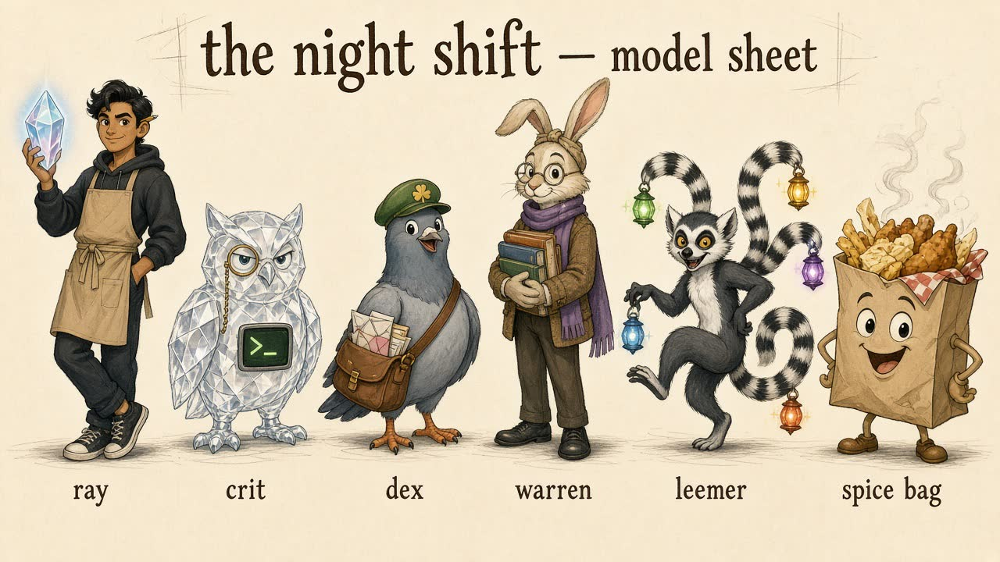

---

## Contents

- [0. TL;DR](#0-tldr)
- [1. Research dossier](#1-research-dossier)
- [2. Audit of the current site](#2-audit-of-the-current-site)
- [3. Story bible](#3-story-bible)
- [4. The cast](#4-the-cast)
- [5. The screenplay: chapter by chapter](#5-the-screenplay-chapter-by-chapter)
- [6. Funny stuff: the gag list](#6-funny-stuff-the-gag-list)
- [7. Inspiring stuff: the heart list](#7-inspiring-stuff-the-heart-list)
- [8. Motion graphics system](#8-motion-graphics-system)
- [9. Art direction and design system](#9-art-direction-and-design-system)
- [10. Asset pipeline: OpenRouter (FLUX.3 + Seedance 2.0 Mini)](#10-asset-pipeline-openrouter-flux3--seedance-20-mini)
- [11. Tech architecture](#11-tech-architecture)
- [12. Sound and voice](#12-sound-and-voice)
- [13. Information architecture and routes](#13-information-architecture-and-routes)
- [14. Live and personal features](#14-live-and-personal-features)
- [15. 21st.dev component sourcing](#15-21stdev-component-sourcing)
- [16. Performance budget](#16-performance-budget)
- [17. Accessibility](#17-accessibility)
- [18. Build phases (tickets + acceptance criteria)](#18-build-phases-tickets--acceptance-criteria)
- [19. Risks](#19-risks)
- [20. Open questions for Repath](#20-open-questions-for-repath)
- [21. Concept frames](#21-concept-frames)

---

## 0. TL;DR

| | v1 (today) | v2 "the night shift" |
|---|---|---|
| Format | A quiet diary: one random square film, then a note. | A scroll-driven **animated storybook** in 9 chapters, with a cast, comedy, a low point, and a comeback. |
| Look | Black, grain, serif. | **Golden-age hand-drawn animation**: ink outlines, gouache backgrounds, Technicolor, film grain, iris wipes, title cards. |
| 3D | None. | Three.js **multiplane camera** (the real technique classic studios used: painted layers on glass at different depths), a real-time **3D crystal** that drops out of the 2D drawing, and video planes. |
| Products | Paragraphs on `/working-on`. DáilDex missing. | Each product is a **character** with its own scene: Crit (critique), Dex (DáilDex), Leemer (LeemerChat), Warren (warren.wiki), Born (LeemerLabs). |
| The takeaway | Not mentioned. | Chapter 1 is the takeaway, a full slapstick set piece, plus a running gag (the ticket printer, Spice Bag). |
| Real films | The whole homepage. | Projected by a vintage projector onto a bedsheet in the attic, real footage inside the cartoon. |
| Ending | Footer. | "the end" gets painted over with **"not even close."**, then old-school scrolling credits. |
| Assets | 11 MP4s. | 68 FLUX.3 images and 25 Seedance 2.0 Mini clips, all defined in `scripts/story/manifest.ts` and generated with one command. |
| Contact | `ray@critique.sh`. | Dex delivers two envelopes: **ray@critique.sh** (dev tools, agents, critique) and **ray@daildex.com** (DáilDex, civic tech, press). |

**What we keep, no matter what:** his lowercase voice, the notes, the letters, the narration, the "develop" blur-to-sharp signature, presence, the hidden thank-you note, and every existing URL.

---

## 1. Research dossier

Sources: repath.life, critique.sh, critique.sh/founder, critique.sh/blog, daildex.com, leemerlabs.com, leemerchat.com/about-us, warren.wiki, github.com/repath500, Repath's public LinkedIn posts.

### 1.1 The person

- **Repath "Ray" Khan.** "ray to some. repath to the work."
- **Waterford, Ireland.** Ireland's oldest city (Viking-founded, 914). Reginald's Tower, the river Suir, the quays. World-famous for **Waterford Crystal**.
- **The takeaway.** From critique.sh/founder: *"I help run a busy takeaway in Waterford — speed, reliability, customers, operations, costs, staff, and pressure are not theory. If something breaks, you feel it immediately."* and *"In a takeaway, nobody cares about your clever theory. Customers wait. Staff stress. Money moves. That shaped how I think about software."*
- **Builds at night.** *"young, outside the usual network, building on nights, testing fast."*
- **Five beliefs (his):** speed matters · taste matters · trust matters · small teams deserve power · Ireland can compete globally.
- **Receipts:** 2,500+ commits in the past year. Billions of tokens through real traffic. In AI since late 2022. Former Analog Devices software intern.
- **His own bar:** *"Can this make a developer genuinely more dangerous? Faster. Sharper. Less blocked."*
- **His taste, in his words:** *"Developer tools do not have to feel dead. Serious engineering can still have a memorable brand."* and *"Infrastructure can feel alive."* A character-driven animated site is exactly that, applied to himself.
- **Emotional register (notes and letters):** survival, resolve, grief, growing up with his brothers, "lost in the middle", "i'm going to win", "i'm not done. not even close." Lowercase. Profanity sparingly, on purpose.

### 1.2 The products → the cast

| Product | What it is (Oct 2026) | Character | Why that character |
|---|---|---|---|
| **critique.sh** | Independent code-review CLI: `critique finish --intent "…" --json` returns outcome, evidence, limits, exit code. CritiqueCode is an open-source agentic coding harness. Community edition open source. His founder page literally calls the mascot language "Crit". | **Crit**, a grumpy glass owl with a monocle and a terminal in its chest. | Owls judge. Glass is Waterford crystal. It reviews what agents wrote, so it's the judge in a courtroom. |
| **DáilDex** (daildex.com) | Follow Irish TDs and Senators, get plain-English, source-linked email alerts when they vote, speak, or ask questions. Reply to ask follow-ups. "Ask Dex" AI assistant. 234 representatives, 43 constituencies. No app, no password, free. Launched 29 Sep 2026; featured in the **data.gov.ie Open Data Showcase** on 1 Oct 2026. Backend open source (MIT). | **Dex**, a carrier pigeon postman in a green cap. | Email-first: a pigeon delivers letters. The assistant is already called Dex. Neutral, friendly, civic. |
| **LeemerChat** | Ireland-built multi-model AI workspace. Started when GPT-4 went down and he needed a backup. Was one of the most used apps on OpenRouter. | **Leemer**, a lemur whose many tails each end in a different-coloured lantern. | "Leemer" sounds like lemur. Many tails = many models. Lanterns = backup light when the big one goes dark. |
| **LeemerLabs** | Independent AI lab in Waterford: Born models (Born-9B Preview), BornBench, European inference, Gaeilge research, fine-tuning. "A language should not need permission to enter the future." | **Born**, a tiny gold-crystal seedling sprite. | The model programme is called Born. Training is growth. |
| **warren.wiki** | Infinite knowledge explorer: wiki mode, rabbit-hole mode, AskWarren. "for people who think in networks, not linear articles." | **Warren**, a scholarly rabbit. | A warren is where rabbits live. Rabbit-hole mode. |
| **the takeaway** | The day job that taught him operations. | **Spice Bag**, a sentient takeaway bag. | The spice bag is Ireland's national takeaway icon. Pure comic relief. |

**Domain note:** the user wrote "DailDex.com". The live product is **daildex.com** (DáilDex). `dialdex.com` is parked and for sale at HugeDomains, so we never link to it. Bonus easter egg: the *Rayner Dialdex* is a 1970s gem refractometer, an instrument that measures how crystal bends light. That's on-theme for a site whose magic object is a crystal.

---

## 2. Audit of the current site

**Keep and elevate:** the voice, the develop mechanic, the 11 films and their one-word titles, ElevenLabs narration ("david"), music crossfades, letters to your future self, presence, public names, the hidden thank-you note, GitHub receipts.

**What's holding it back:**
1. No place, no story, no scale. Nothing says Waterford, takeaway, Ireland, or ambition.
2. The work is buried in paragraphs. **DáilDex is missing entirely**, even though it's his newest launch and has government recognition.
3. One visual treatment repeated everywhere.
4. Motion is decorative fades only.
5. `App.tsx` is 933 lines and mixes the audio engine, video state, typography, and layout, with duplicated desktop/mobile blocks. It needs splitting before anything else.
6. Mixed-aspect films (`11.mp4` is 576×1024, `12.mp4` is 1024×576) are cropped to a square.
7. `README.md` describes an older version.

---

## 3. Story bible

### 3.1 Theme

**Pressure makes crystal.** The takeaway, the late nights, and the hard seasons in the notes are the pressure. The products are the light that comes out. The story never pretends it's easy. Chapter 4 is the honest low point (straight from his second public letter), and the comeback is earned by the small things he kept: his notes, as fireflies.

### 3.2 Tone

| Ratio | Mode | Where |
|---|---|---|
| 40% | **Funny**: slapstick, sidekick bickering, visual gags | Counter, night shift, product beats, 404, intermission, credits |
| 35% | **Wonder**: magic, light, flight | Storybook, crystal, Dex over Ireland, sunrise |
| 25% | **Heart**: honest, quiet, a bit raw | The middle (fog), notes, letters, bottles |

Rule of thumb: **every heavy beat is followed by a light one, and every gag lands on something true.**

### 3.3 Narration voice

Two voices, clearly separated:

- **The narrator** (storybook voice, sentence case allowed only inside the book art): *"once upon a time, in waterford, the oldest city in ireland…"* Read aloud by the existing ElevenLabs "david" voice.
- **Ray** (his real voice, lowercase, first person). Notes, letters, and the short lines in each chapter. Never polished.

### 3.4 Visual rules

1. Everything hand-drawn **except two things**: the **crystal** (real-time 3D glass) and **Ray's real films** (photographic). Those are the "real" things in the cartoon world, his inner light and his real life. This contrast is the site's signature, a bit like a live-action-meets-animation film.
2. Night scenes: indigo with warm practical light. Day scenes: Technicolor warmth.
3. Products only appear in their own colour inside their own scene.

---

## 4. The cast

| Character | Personality | Catchphrase / tic | Motion notes | Appears in |
|---|---|---|---|---|
| **Ray** | Determined, warm, tired but stubborn. Funny under pressure. | *"figure it out, i guess."* | Snappy, fast at the counter; slow and deliberate at the desk. | Everywhere |
| **Crit** | Grumpy perfectionist with a soft centre. Never impressed, secretly proud. | *"exit 2."* (unimpressed) / *"…exit 0."* (rare, proud) | Minimal movement, big eyebrow acting, monocle pops off when shocked. | Night shift, court, credits, scroll-speed gag |
| **Dex** | Eager, chatty, neutral to a fault. Will not tell you how to vote. | *"straight from the record!"* | Bouncy, flappy, always slightly out of breath. | Map flight, contact envelopes, letter delivery |
| **Leemer** | Mischievous show-off, saves the day then takes a bow. | *"backup's here."* | Swinging, upside down, tails swirling like a light show. | Lights-out, loading, idle screensaver |
| **Warren** | Absent-minded professor. Gets distracted by everything. | *"ooh, but have you read about…"* | Floaty, reading while falling. | Rabbit hole, tooltips |
| **Born** | Tiny, curious, quietly growing. | (no words, just chimes) | Gentle bobbing, grows a little every visit. | Greenhouse lab, seasonal growth |
| **Spice Bag** | Chaos agent. Hungry. Always where it shouldn't be. | *"…me?"* | Rubber-hose dance, crumbs everywhere. | Counter, 404, intermission, credits |
| **The Fog** | Not a villain, a feeling. Grey, shapeless, made of question marks and unfinished apps. | (silence) | Slow, heavy, swallows colour. | Chapter 4 only |

---

## 5. The screenplay: chapter by chapter

Each chapter lists the **beat**, the **scroll mechanic**, the **assets** (ids from `scripts/story/manifest.ts`), **copy**, and **interactions**. The DOM scrolls natively; a single fixed WebGL canvas behind it plays the scene for the current chapter.

### Prologue: the projector light

- **Beat:** black screen. Projector whirr. A flickering countdown leader (8, 7, 6…) in the classic film-leader circle, drawn in ink. Then a title card: **"a waterford picture"**.
- **Mechanic:** plays once (about 3s), skippable by click, scroll, or any key. Skipped automatically for returning visitors and reduced motion.
- **Assets:** CSS/SVG countdown + `OldFilm` shader. No generated asset needed.

### Chapter 0: once upon a time

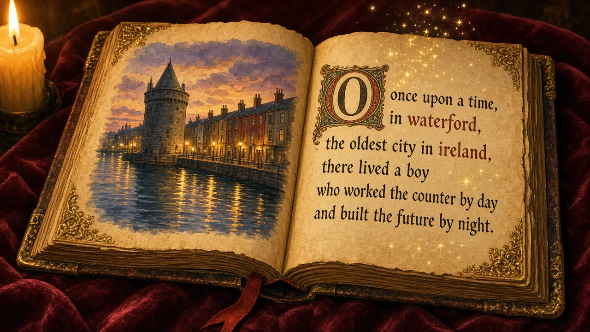

- **Beat:** the leather storybook (`sc00-cover`) sits on red velvet. The faceted crystal set into the cover is **real 3D glass**, catching light and following your cursor. Click it (or scroll) and the book opens (`v00-book-opens`, cover → first page). Narrator: *"once upon a time, in waterford, the oldest city in ireland, there lived a boy who worked the counter by day and built the future by night."*
- **Multiplane moment:** the watercolour of Waterford on the left page **lifts off the page** into five depth layers (`mp-quay-0-sky` … `mp-quay-4-near`). The camera dollies *into* the picture: sky far back, the round tower in the middle, the quay railing and lamp sliding past in front. This is the multiplane camera, rebuilt in Three.js.
- **Copy (overlay, lowercase):** `i am repath` (hand-lettered, `ui-title-lettering`) · `waterford, ireland · builder · {waterford time}`
- **Interactions:** the crystal rings when hovered (one pitch per facet); drag to spin it. A "skip the story" link goes straight to `/work` for people in a hurry (recruiters, founders).

### Chapter 1: the counter

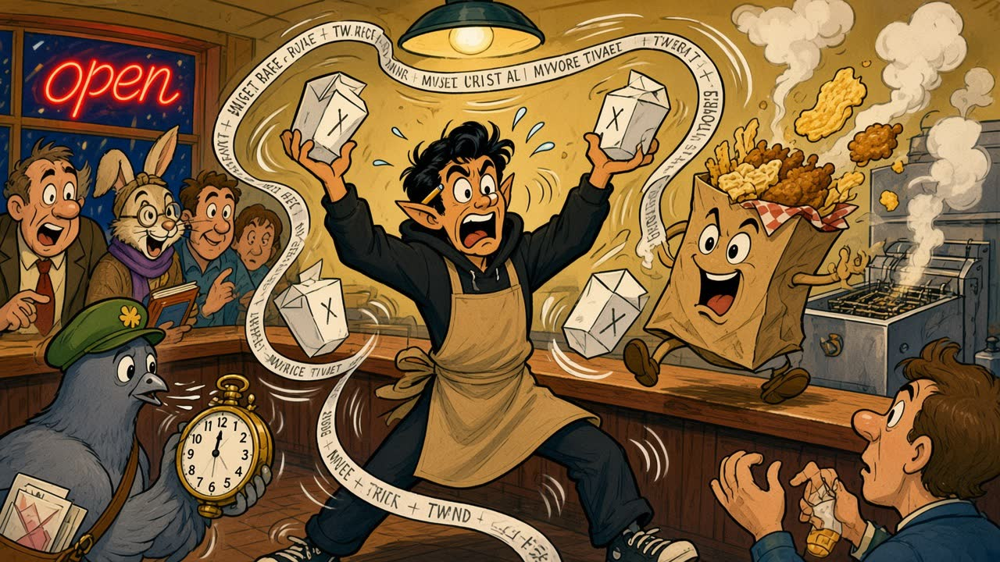

- **Beat:** 6pm rush at the takeaway. Ray juggles boxes, the phone rings, the ticket printer goes feral, Spice Bag escapes, customers check their pocket watches. Pure slapstick (`sc02-counter`, `v02-counter-chaos`).
- **Mechanic:** pinned scene; scroll speeds up the chaos (the ticket ribbon unspools faster as you scroll). At the end of the pin, the shop shutter slams down with a cartoon *clang* and the lights go off. Night.
- **Real ticket rail (DOM, crisp):** thermal-paper tickets print down the side with real-looking orders that are actually his story:
  - `#0914 · 1× spice bag · 1× curry chips · collection 18:40`
  - `#2025 · 2,500 commits · extra spicy · no rush`
  - `#0001 · 1× big dream · hold the doubt`
  - `#4040 · 1× existential crisis · salt & vinegar`
- **Copy (Ray):** *"in a takeaway, nobody cares about your clever theory. customers wait. staff stress. money moves. that shaped how i think about software."*
- **Interactions:** the cursor becomes a salt shaker; click to salt the scene (salt particles). Click Spice Bag to make it dance.

### Chapter 1b: the reel (his real films)

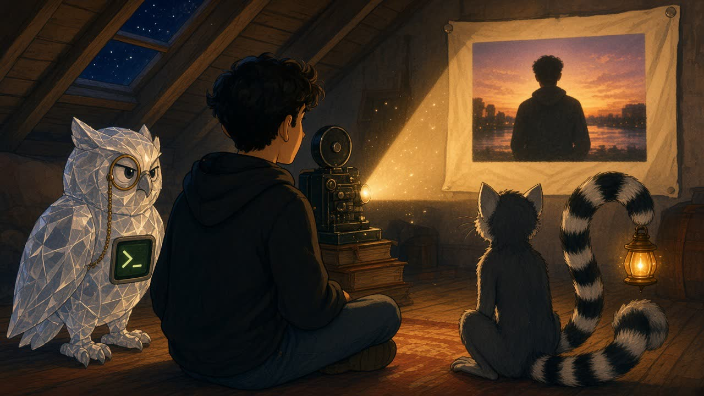

- **Beat:** upstairs in the attic, after the shift. Ray threads a projector. His **real films** play on a bedsheet: real life inside the drawing (`sc17-projector`, `v01b-projector`).
- **Mechanic:** the sheet area is a Three.js plane with a `VideoTexture` of the selected film, with a projector-light shader on top (warm falloff, flicker, dust, slight keystone). All v1 film behaviour is kept: sound-on attempt with "tap for sound" fallback, music crossfade, the develop effect on the note after the film ends, narration, progress tracking, the hidden note.
- **Choosing a film:** a row of **film canisters** on a shelf, each labelled in hand lettering (`01 living`, `02 fly`, … `12 figure it out`). Click one and Ray swaps the reel (2-frame cartoon swap animation).
- **Aspect ratios:** the sheet resizes to match each film (square, portrait, landscape). Nothing is cropped.
- **Copy:** `frames` / *"some moments i kept, and the small truths they left behind."* (v1 line)

### Chapter 2: two worlds

- **Beat:** Ray split down the middle: apron and takeaway bag on the left in sodium amber, hoodie and laptop on the right in moonlit blue (`sc03-two-worlds`).
- **Mechanic:** a **draggable divider**. Drag left and the takeaway side grows (ambient fryer and till sounds); drag right and the lab side grows (keyboard and fan). At the centre the light mixes into white on the crystal hanging above him.
- **Copy:** left label `the counter`, right label `the terminal`. Centre: *"two worlds. same person. one taught me pressure, the other taught me leverage."*
- **Terminal (right half, DOM):** types out a real critique run:

```
$ critique finish --intent "stop duplicate charges" --json
→ change reconstructed       ready
→ reproduction + limits      attached
→ outcome                    repair_ready
exit 2
```

### Chapter 3: the night shift (the products)

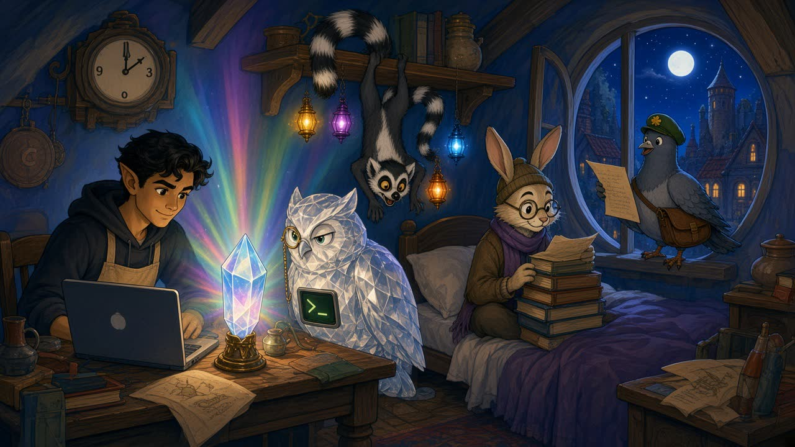

- **Beat:** 3am in the attic. The crystal glows and, one by one, **the sidekicks come to life in its light** (`sc04-night-shift`, `v04-night-shift`). Each is introduced with its own short scene, like a classic character-intro montage.
- **Mechanic:** pinned horizontal scroll on desktop (5 panels), vertical stack on mobile. Each panel: scene art or loop, character name card, product name, one line, a live stat, `visit →` and `go deeper →` (to `/work/:slug`).

| Panel | Scene | Character beat | Product line | Live stat |
|---|---|---|---|---|
| **3.1 leemerchat** | `sc05-leemer-backup`, `v05-leemer-arrives` | The big monitor goes dark with a sad face; Ray's eyes go huge; Leemer swings in, lanterns blazing: *"backup's here."* | *"started when gpt-4 went down. became the main thing."* | models available |
| **3.2 critique** | `sc06-crit-court`, `v06-crit-gavel` | Courtroom. A sweaty robot coding agent presents a looong scroll. Crit squints, bangs the gavel, stamps **repair ready**. Chest screen: `exit 2`. | *"your agent writes the change. critique checks it."* | latest CLI version, `npm i -g @critiquedotsh/cli` copy button |
| **3.3 dáildex** | `sc07-dex-flies`, `v07-dex-flight` | Dex flies over a storybook map of Ireland at dawn, a kite-tail of envelopes behind. *"straight from the record!"* | *"see what your td said, did and voted for — in your inbox."* | **234 TDs and Senators · 43 constituencies · as featured on data.gov.ie** |
| **3.4 warren.wiki** | `sc08-warren-hole`, `v08-warren-fall` | Warren falls down an endless rabbit hole of bookshelves, reading, unbothered. | *"for people who think in networks, not linear articles."* | — |
| **3.5 leemerlabs** | `sc09-born-grows`, `v09-born-grows` | In a tiny rooftop greenhouse lab, Born grows a crystal lattice. A chalkboard curve slopes down. Gaeilge on the seed packets. | *"ai made for irish reality."* | Born-9B Preview |

- **DáilDex panel interaction (the 3D one):** hover the map and it turns into a **3D point-cloud Ireland** (Three.js instanced points grouped by the 43 constituencies). Every few seconds a constituency pulses and a sample alert card floats up: `your td voted tá on a housing motion · official record ↗`. Non-partisan: no party colours, generic topics only, matching DáilDex's own framing.
- **critique panel interaction:** a mini terminal where you can run three canned `critique finish` scenarios and watch Crit react (exit 0 makes Crit do a tiny proud nod; that's the rarest animation on the site).

### Chapter 4: the middle

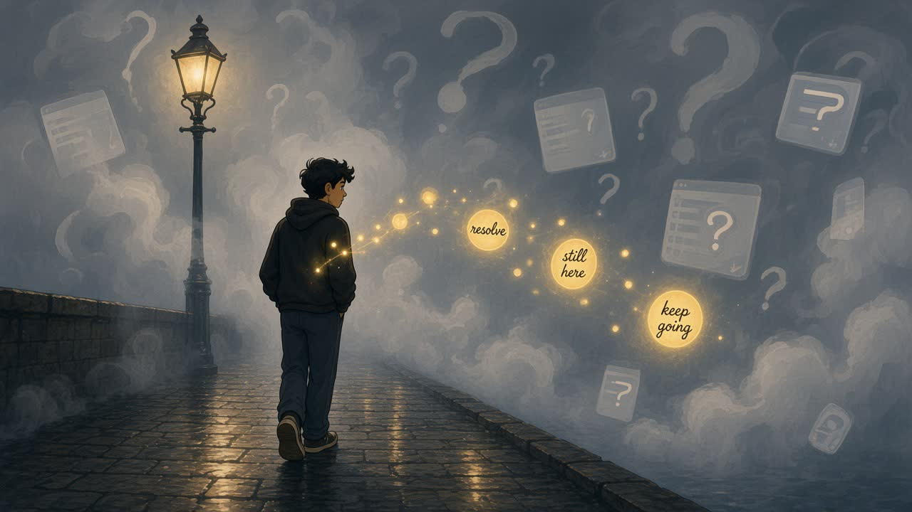

- **Beat:** the honest part. Ray walks the quay alone in the rain. The Fog rolls in, made of question marks and half-finished app windows (`sc10-fog`, `v10-fog`). The colour drains out of the whole page (a CSS/WebGL saturation pass driven by scroll).
- **Copy:** lines from his second public letter, revealed one at a time with the develop effect:
  - *"i don't really know what i'm chasing right now."*
  - *"not broken. not finished. just tired in a way that is hard to explain."*
  - *"but even with all of that, there is still something in me that hasn't fully given up."*
- **The turn:** small gold fireflies rise from his pocket, each carrying a word from his notes (`resolve`, `still here`, `keep going`). They light a path through the fog. As you scroll, colour returns, first in the fireflies, then everywhere.
- **Sound:** music ducks almost to silence; rain only. Then a single warm note when the first firefly lights.
- **No gags in this chapter.** Not one.

### Chapter 5: notes (the fireflies)

- **Beat:** a meadow on the banks of the Suir at night, full of fireflies (`sc11-fireflies`, `v11-fireflies`). **Every firefly is one of his notes.**
- **Mechanic:** Three.js instanced fireflies at different depths, each tied to a note. Mood maps to behaviour: `light` notes are bright and quick, `soft` ones gentle, `heavy` ones dim and slow and further away. Hover or focus a firefly and it drifts forward; click it and the note opens on a parchment card with the develop effect, `listen` narration, and `share`.
- **Keyboard and screen readers:** a visually-hidden list of all notes, in order, with the same open action.
- **The hidden note** (finish every note and film) arrives as a single firefly that's brighter than the rest, flying straight to you.

### Chapter 6: receipts

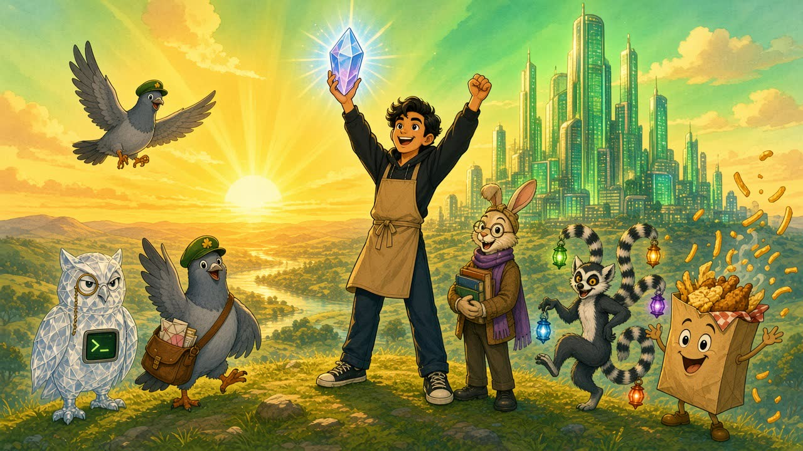

- **Beat:** dawn. Ray on the hill above Waterford, crystal raised; the sidekicks cheer; Spice Bag throws chips like confetti (`sc12-sunrise`, `v12-sunrise`).
- **The 3D bit:** the "glass city" below **is his real GitHub contribution graph**: a 7 × 52 grid of glass towers in Three.js, height = commits that day, glowing green. The painted sunrise is the backdrop; the 3D city is composited into the valley. Hover a tower: `tue 14 jul · 23 commits`.
- **Counter:** `2,5xx commits in the last year` ticks up (number ticker).
- **Ship log** as a parade marquee along the bottom: `sep 2026 · dáildex launched` · `oct 2026 · dáildex on data.gov.ie` · `sep 2026 · critiquecode open sourced` · `may 2026 · critique community edition` · `apr 2026 · warren rabbit hole mode` …
- **Copy:** `github is the receipts.` / *"some commits become products. some become infrastructure. some become lessons."*
- **His beliefs** appear as five banners carried by the sidekicks: speed matters · taste matters · trust matters · small teams deserve power · **ireland can compete globally**.

### Chapter 7: write one

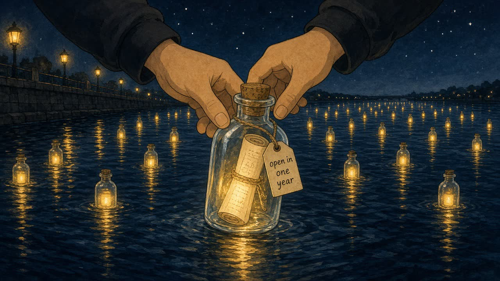

- **Beat:** night again, on the river. Ray places a glowing bottle on the Suir. Dozens of others already drift toward the sea: everyone else's letters (`sc13-bottle`, `v13-bottles`).
- **Ray's public letters** first: rendered on parchment with an ink-bleed reveal shader (latest letter first, as in v1). Narration available.
- **Then the visitor writes one** (the existing letter feature, local-first, with delivery dates). On "seal it", the parchment rolls, slides into a bottle, the cork pops in, and the bottle joins the river in the 3D scene with the delivery date on its tag.
- **On the delivery date**, Dex flies across the screen when they return and drops the bottle at their feet: *"post for you!"*
- **Copy:** `write one too.` / *"seal it, or don't. keep it private, or leave it open. you do you."* (from letter 1)
- **Names:** "leave your name on the crystal" (existing `/api/names`). Names get engraved around the base of the 3D crystal like a trophy dedication.

### Chapter 8: not even close

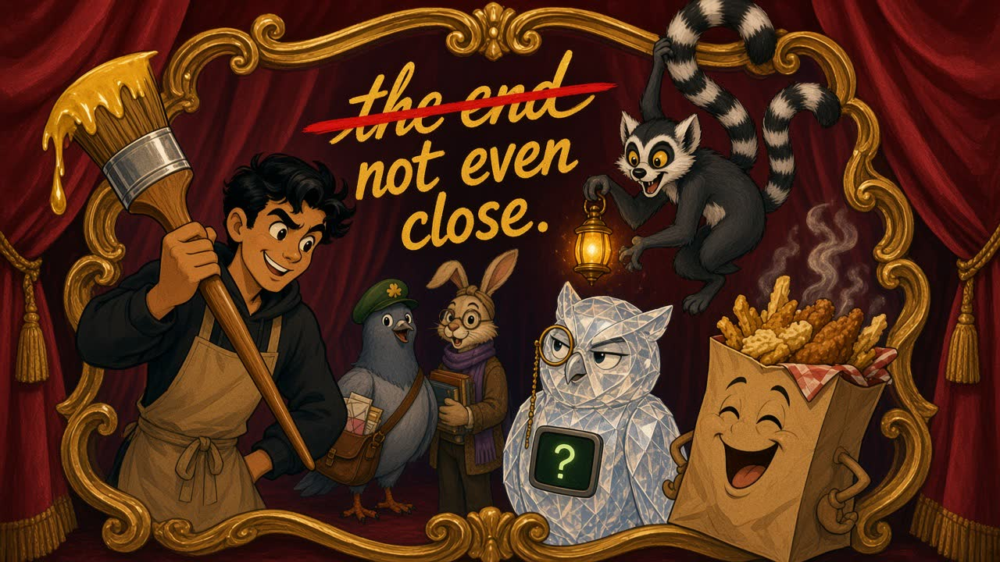

- **Beat:** the classic red-velvet end card fades in: **"the end"** (`sc14-the-end`). A beat of silence. Then Ray leans in with a giant paintbrush, strikes it out, and paints **"not even close."** (`v14-not-even-close`, first frame `sc14`, last frame `sc15`). The cast pile into frame.
- **Contact:** Dex flies in with **two envelopes**, each a big tappable card:
  - **"about critique, agents, dev tools"** → `ray@critique.sh`
  - **"about dáildex, civic tech, press"** → `ray@daildex.com`
  - Line above: *"if you're building in this space, i want to hear from you."*
- **Credits roll** (old-school, over `sc19-credits`), funny but true:

```
the night shift
a waterford picture

written & directed by ........ repath khan
also known as ................ ray
code review .................. crit
postal service ............... dex
lighting ..................... leemer
research ..................... warren
growing ...................... born
catering ..................... the takeaway
chaos ........................ spice bag
commits ...................... 2,5xx and counting

filmed on location in waterford, ireland
no ai wrappers were harmed in the making of this website

special thanks
to everyone who stayed long enough to read it.
```

- **Final frame:** iris-out on the crystal. Then a tiny line: `stay for more? ↺` that starts the story from the top.

---

## 6. Funny stuff: the gag list

Each gag is small, optional, and never blocks content.

| # | Gag | Trigger | Implementation |
|---|---|---|---|
| 1 | **Crit judges your scrolling.** Crit pops up in the corner: `exit 2 — scrolled too fast. you missed a note.` | Scroll velocity above a threshold for over 1.5s | Lenis velocity → sprite `v-sprite-crit` + speech bubble |
| 2 | **Lights out, Leemer saves you.** The page dims to black, then Leemer swings in with lanterns. | 60s idle | Overlay + `v-sprite-leemer`, any input restores |
| 3 | **Spice Bag ate the 404.** | Any unknown route | `sc16-lost-404`, copy: *"this page got eaten. sorry. it was very good."* |
| 4 | **Intermission.** Card: `intermission — go get a snack`. Spice Bag: *"…me?"* | 8+ minutes of active reading | `sc18-intermission`, dismissible, once per visit |
| 5 | **Visitor ticket.** A ticket prints with your visitor number and order: `#5172 · 3 films · 2 notes · 1 letter · thank you, come again`. Shareable PNG. | Footer button / on leaving the credits | Canvas render, thermal-paper style |
| 6 | **Salt shaker cursor.** | Chapter 1 | Custom cursor, click = salt particles |
| 7 | **Spice bag mode.** Chips rain from the top of the screen. | Konami code or typing `spicebag` | Instanced chip particles |
| 8 | **Secret terminal.** `critique finish --intent "build a life"` → `outcome: in_progress · evidence: 2,5xx commits, 11 films, 2 letters · limits: still in the middle · exit 0`. Also `whoami`, `ls work/`, `cat notes/06`, `play 09`, `gaeilge`, `rain`, `credits`. | Type `critique` or press `⌘K` → "terminal" | Quake-style drop-down |
| 9 | **3am.** At exactly 03:00–03:59 Waterford time, a banner: `the night shift is on. ray's probably awake.` The crystal glows brighter. | Waterford clock | Time check |
| 10 | **Warren tooltips.** Hover certain underlined words (waterford, crystal, vikings, spice bag) for a rabbit-hole card chain that always ends back at "this website". | Hover/focus | Popover chain |
| 11 | **Refractometer.** Hold `R` on the crystal: `refractive index ≈ 1.56 · lead crystal · origin: waterford`. | Key hold / long-press | Overlay (a nod to the Rayner Dialdex refractometer) |
| 12 | **Dex refuses to pick a side.** Click Dex 5 times: *"i don't do opinions. i do sources."* | Clicks | Speech bubble |
| 13 | **Crit's rare approval.** Watch every film to the end and Crit gives a single slow nod: `exit 0`. Rarest animation on the site. | `progress.ts` all films | Sprite state |

---

## 7. Inspiring stuff: the heart list

1. **The middle is in the story.** Most personal sites only show wins. This one has a chapter where he's lost, in his own words, and shows how he got through it.
2. **Notes as fireflies.** The things he wrote to himself literally light the way out of the fog.
3. **"the end" → "not even close."** The thesis of the whole site in one gag.
4. **Ireland can compete globally.** Waterford isn't a backdrop, it's the hero's home. DáilDex's data.gov.ie feature is shown as proof.
5. **Receipts, not claims.** The glass city is his real commit history.
6. **The visitor joins the story.** Write a letter, seal it in a bottle, and Dex brings it back on the date you picked.
7. **Credits thank the reader.** *"to everyone who stayed long enough to read it."*

---

## 8. Motion graphics system

### 8.1 The building blocks

| Technique | What it does | Tech |
|---|---|---|
| **Multiplane camera** | Painted layers at different depths; the camera dollies through them for real parallax. The classic studio technique, rebuilt in WebGL. | R3F: one `planeGeometry` per layer, keyed WebP textures, positioned along z, camera on a scroll-driven spline. Slight per-layer blur for depth of field. |
| **Generated loops** | Each scene breathes: steam, sparkles, fireflies, characters blinking. | Seedance 2.0 Mini image-to-video with **first frame = last frame** for seamless loops; played as `VideoTexture` on the scene plane or as a DOM `<video>`. |
| **Generated transitions** | Story beats that need real animation: the book opening, Leemer's entrance, Crit's gavel, the "not even close" paint gag. | Seedance **first frame → last frame** interpolation between two FLUX images. |
| **Sprite mascots** | Small characters that pop into the UI corners (Crit, Leemer, Dex, Spice Bag, Born). | Green-screen FLUX pose → Seedance idle loop → ffmpeg chroma key → **VP9 alpha WebM** (Chrome/Firefox) + **HEVC alpha MOV** made on macOS for Safari, with a static PNG fallback. |
| **The crystal** | The one real 3D object in a 2D world. | drei `MeshTransmissionMaterial`, faceted icosahedron, `ior ≈ 1.56`, chromatic aberration, drag-to-spin with inertia. Rendered *on top of* the painted storybook cover so it looks like the drawing came alive. |
| **Old-film post-processing** | Makes everything feel like a 1940s print. | Custom `postprocessing` Effect `OldFilm`: grain, gate weave (sub-pixel jitter), luminance flicker, dust and hair specks, soft vignette, slight colour bleed. Intensity per chapter (strong in the prologue, almost off in the notes). |
| **Animated on twos** | Classic hand-drawn cadence (12 drawings per second). | Optional `steps()` timing for character overlays and sprite playback at 12fps, while the camera stays smooth at 60fps. That contrast is what makes it feel hand-made. |
| **Iris wipe** | The classic circle that closes on a character to end a scene. | CSS `clip-path: circle()` animated with Motion; used for route changes and the finale. |
| **Page turn** | Moving between chapters on mobile, or into `/work/:slug`. | A curled plane in Three.js (vertex shader bend) or CSS 3D for the low tier. |
| **Title cards** | "chapter 3 — the night shift" between chapters. | `ui-chapter-0x` art + `OldFilm` + a 1.2s hold. |
| **Develop** | v1's blur → sharp signature, used for all body text. | `<Develop progress>` component (blur, opacity, translateY), driven by scroll or video progress. |
| **Hand-lettered type** | Titles look painted, not typeset. | Generated lettering (`ui-title-lettering`) as keyed WebP; SVG stroke-draw for short labels. |

### 8.2 Scroll choreography

- **Lenis** for smooth native scrolling. **Motion** (`useScroll`) for DOM timelines. A **zustand** store (`chapter`, `progress`, `velocity`, `mood`, `tier`) that the canvas reads in `useFrame` without React re-renders.
- **Pinned scenes:** Chapter 1 (the counter), Chapter 3 (horizontal products), Chapter 4 (the fog walk). Everything else scrolls naturally.
- **Timing law:** the easing curve stays v1's `cubic-bezier(0.16, 1, 0.3, 1)`. Character pops use an overshoot spring (`stiffness 260, damping 14`) for cartoon squash and stretch.

### 8.3 Classic animation principles, applied to UI

| Principle | UI use |
|---|---|
| Squash and stretch | Buttons squish on press, then spring back. |
| Anticipation | Cards dip 2px before they fly up. |
| Follow-through | Speech bubbles overshoot, then settle. |
| Staging | Only one moving focal point per screen. Everything else holds. |
| Secondary action | Sidekicks blink and fidget while you read. |
| Timing | Fast gags, slow heart. |
| Appeal | Every character readable as a silhouette at 64px. |

---

## 9. Art direction and design system

### 9.1 Style

**Golden-age 1940s hand-drawn cel animation:** confident ink outlines, flat cel colour with soft painted shading, lush gouache and watercolour backgrounds, three-strip Technicolor warmth, film grain. Defined once as `STYLE` in `scripts/story/manifest.ts` so every asset matches.

We describe the **technique**, never a studio or its characters. Prompts never say "Disney", and no existing characters are referenced. The cast is 100% original. (See §19.)

### 9.2 Colour tokens (Tailwind 4 `@theme`)

```css
@theme {
  --color-velvet: #7a1e22;      /* curtains, end cards */
  --color-gold: #d9a441;        /* gold leaf, frames, lettering */
  --color-parchment: #f2e6cc;   /* storybook pages, notes, letters */
  --color-ink: #1b1410;         /* outlines, text on parchment */
  --color-night: #141a3a;       /* night scenes, base background */
  --color-night-deep: #0b0f24;
  --color-moon: #7fa7d9;        /* lab side, moonlight */
  --color-sodium: #ff9f43;      /* takeaway side, street lamps */
  --color-firefly: #ffd36b;     /* notes */
  --color-fog: #8a9099;         /* chapter 4 */

  /* product accents (only inside their own scene) */
  --color-critique: #39d353;
  --color-daildex: #169b62;
  --color-leemerchat: #8b5cf6;
  --color-leemerlabs: #e9d8a6;
  --color-warren: #7f9f6a;
}
```

### 9.3 Typography

| Role | Font | Notes |
|---|---|---|
| Storybook display | **IM Fell English** / **IM Fell DW Pica** (Google Fonts, free) | Old book type for narrator text and chapter labels. |
| Big titles | **Generated hand lettering** (keyed WebP) | `i am repath`, `the night shift`, chapter titles. |
| Ray's voice (notes, letters) | **Fraunces** (soft, slightly wonky optical axes) or keep **Crimson Text** | Warm, readable, a little hand-made. Lowercase. |
| UI labels | **Inter Tight** | Small, clean, lowercase, tracked. |
| Terminal, tickets, credits leaders | **JetBrains Mono** | Crit, the critique terminal, takeaway tickets. |

Self-host everything (`@fontsource/*`).

### 9.4 Surfaces

- **Parchment card** (notes, letters): `--color-parchment`, paper fibre texture, deckled edge mask, ink text.
- **Velvet** (end card, intermission, credits): deep red with a soft fabric normal map.
- **Ticket** (takeaway): thermal paper `#f4f1ea`, torn zig-zag edge, mono.
- **Night glass** (UI chrome over scenes): `bg-night/60 backdrop-blur-md`, gold 1px hairline.

---

## 10. Asset pipeline: OpenRouter (FLUX.3 + Seedance 2.0 Mini)

### 10.1 Models (checked live on OpenRouter, Oct 2026)

| Model | Endpoint | What we use it for | Constraints | Price |
|---|---|---|---|---|
| `black-forest-labs/flux-3-image` | `POST /api/v1/images` | All stills: model sheets, scenes, multiplane layers, UI art, sprite key poses | `resolution` 768/1K/1.5K/2K/4K · many aspect ratios · `n` = 1 · **up to 10 `input_references`** (used for character consistency) · `seed` | $0.041 (768) · $0.048 (1K) · $0.07 (1.5K) · $0.10 (2K) · $0.607 (4K) per image |
| `bytedance/seedance-2.0-mini` | `POST /api/v1/videos` (async: submit → poll → download) | Loops, transitions, sprite idles | 480p/720p · sizes up to 1280×720 / 720×1280 / 720×720 · **4–15s** · `frame_images` with `first_frame` and `last_frame` · optional generated audio · `seed` | Billed per video token (`$0.0000035`/token); actual cost logged per job |

### 10.2 What's in the repo now

```
scripts/story/
  manifest.ts     # the whole shot list: 68 images + 25 videos, prompts, refs, sizes
  generate.ts     # OpenRouter runner (dependency-ordered, resumable, retries, cost ledger)
  optimize.sh     # raw → web: AVIF/WebP, chroma-key sprites, H.264 + VP9, posters
docs/story/concepts/   # 12 concept frames used in this plan
```

`package.json` scripts:

```bash
npm run story:generate -- --dry                 # plan + estimated image cost, no API calls
npm run story:generate -- --stage=refs          # characters first (review them!)
npm run story:generate -- --kind=image          # all stills
npm run story:generate -- --kind=video          # all clips (needs the stills)
npm run story:generate -- --only=sc02-counter --force   # redo one shot
npm run story:generate -- --kind=video --audio  # let Seedance add audio where marked
npm run story:optimize                          # make web versions in public/story/
```

Add `OPENROUTER_API_KEY` to `.env` locally (template in `.env.example`) or as a Cursor Cloud Agent secret.

### 10.3 How consistency works

1. **Stage 1: the model sheet** (`char-lineup`, fixed `seed: 1914`) defines the cast.
2. **Turnarounds** per character (`char-<name>-turnaround`) take the lineup as a reference.
3. **Every scene** passes the lineup plus the relevant turnarounds as `input_references` (FLUX.3 accepts up to 10).
4. **Mobile 9:16 versions** of each scene also take the desktop scene as a reference, so they're recompositions, not new paintings.
5. **Videos** use the scene stills as `first_frame` (and `last_frame` for loops/transitions), so motion starts and ends exactly on approved art.
6. **Human review gates:** approve the lineup → approve turnarounds → then run scenes. Re-roll anything off-model with `--only=<id> --force`.
7. **Ray's likeness:** with his OK, add 2–3 real photos as extra references for `char-lineup` and `char-ray-turnaround` so cartoon Ray actually looks like him.

### 10.4 Shot list summary

| Group | Count | Examples |
|---|---|---|
| Character refs | 8 | `char-lineup`, 7 turnarounds |
| Sprite key poses (green screen) | 5 | `sprite-crit`, `sprite-dex`, `sprite-leemer`, `sprite-spicebag`, `sprite-born` |
| Story scenes (16:9 + 9:16) | 40 | `sc00-cover` … `sc19-credits`, each with a `-mobile` twin |
| Multiplane layers (21:9) | 5 | `mp-quay-0-sky` … `mp-quay-4-near` |
| UI art | 10 | `ui-title-lettering`, 7 chapter cards, `ui-og`, `ui-favicon-crit` |
| **Images total** | **68** | **≈ $5.65** at the listed resolutions |
| Scene loops | 11 | `v01-storybook-idle`, `v01b-projector`, `v04-night-shift`, `v10-fog`, `v12-sunrise` … |
| Transitions / beats | 4 | `v00-book-opens`, `v05-leemer-arrives`, `v06-crit-gavel`, `v14-not-even-close` |
| Sprite idles | 5 | `v-sprite-*` (720×720, 4s) |
| Mobile loops | 5 | `v-mobile-*` (720×1280, 6s) |
| **Videos total** | **25** | cost logged to `scripts/story/ledger.jsonl` |

Budget guidance: expect 2–3 re-rolls on hero shots. Plan for about **$15–20 of images** in total, and check the first few video jobs' logged cost before running the full video batch.

### 10.5 Web delivery

`optimize.sh` produces:

- Stills: AVIF + WebP at ≤ 2560px (hero) / ≤ 1280px (mobile).
- Keyed layers and sprites: transparent WebP.
- Loops: H.264 MP4 (`faststart`) + VP9 WebM at ≤ 1280px, muted unless the clip has designed audio, with a WebP poster for each.
- Sprite loops: VP9-alpha WebM at 360px/12fps (Safari needs an HEVC-alpha `.mov` exported on macOS with `avconvert` or Compressor; fallback is the static PNG).

Hosting: move `public/story/video` to **Vercel Blob** (or any CDN) once it passes ~50 MB, so the git repo stays light.

---

## 11. Tech architecture

### 11.1 Dependencies

```bash
npm i three @react-three/fiber @react-three/drei @react-three/postprocessing postprocessing \
      motion lenis zustand maath suncalc
npm i -D @types/three @types/suncalc leva r3f-perf vite-plugin-glsl rollup-plugin-visualizer
npm i cmdk            # command palette (via shadcn)
npm i detect-gpu      # starting quality tier
```

React 19 is already in the repo; `@react-three/fiber` v9+ supports it. Stay on Vite. Vercel already serves `/api/*` edge functions.

### 11.2 File structure

```
src/
  main.tsx
  app/
    Root.tsx                # router + providers + ONE persistent <Canvas>
    routes.ts               # extends router.ts; keeps /notes/:id, /letter/:id
  state/
    useStory.ts             # zustand: chapter, progress, velocity, mood, tier, gags
    useAudio.ts             # extracted from App.tsx (music, narration, ducking, sfx)
    useFilms.ts             # extracted from App.tsx (queue, progress, develop)
    useProgress.ts          # wraps progress.ts (films/notes completed, hidden note)
  scene/
    StoryCanvas.tsx         # Canvas, PerformanceMonitor, AdaptiveDpr, Suspense
    CameraRig.tsx           # scroll-driven spline per chapter
    Multiplane.tsx          # layered planes at depth (generic, data-driven)
    ScenePlane.tsx          # still → loop video texture swap, with poster
    Crystal.tsx             # 3D crystal (transmission material, facet hit-testing)
    Projector.tsx           # bedsheet video plane + projector light shader
    IrelandPoints.tsx       # DáilDex 3D point map (43 constituencies)
    GlassCity.tsx           # GitHub contributions → instanced towers
    Fireflies.tsx           # notes as instanced fireflies
    Bottles.tsx             # sealed letters drifting on the river
    Rain.tsx                # rain-on-glass pass (Waterford weather)
    effects/
      OldFilm.ts            # custom postprocessing Effect
      OldFilm.frag.glsl
    shaders/
      projectorLight.frag.glsl
      inkReveal.frag.glsl
      pageCurl.vert.glsl
  chapters/
    Prologue.tsx  OnceUponATime.tsx  TheCounter.tsx  TheReel.tsx
    TwoWorlds.tsx NightShift.tsx     TheMiddle.tsx   Notes.tsx
    Receipts.tsx  WriteOne.tsx       NotEvenClose.tsx
  characters/
    Sprite.tsx              # alpha-video mascot with PNG fallback
    SpeechBubble.tsx
    gags/                   # one file per gag in §6, lazy-loaded
  components/
    ui/                     # shadcn + 21st.dev (owned code)
    Develop.tsx  TitleCard.tsx  IrisWipe.tsx  Ticket.tsx  Terminal.tsx
    Nav.tsx  Dock.tsx  CommandPalette.tsx  LiveWaterford.tsx  Credits.tsx
  content/
    story.ts                # chapter copy, narration lines, credits
    films.ts  notes.ts  letters.ts  ecosystem.ts  shiplog.ts  gaeilge.ts
    assets.ts               # generated from scripts/story/manifest.ts (ids → URLs)
api/
  names.ts notes.ts presence.ts speak.ts      # existing
  waterford.ts                                 # weather + sun (Open-Meteo, cached)
  now.ts                                       # GitHub events (cached)
  contributions.ts                             # GitHub contribution calendar (cached)
scripts/story/
  manifest.ts generate.ts optimize.sh          # added in this PR
```

### 11.3 Key patterns

**DOM drives, canvas follows.** All content is real HTML. Chapters register with an `IntersectionObserver` + Lenis progress, write to zustand, and the canvas reads it in `useFrame`:

```tsx
// scene/CameraRig.tsx
useFrame((state, delta) => {
  const { chapter, progress } = useStory.getState()
  const path = cameraPaths[chapter]
  easing.damp3(state.camera.position, path.position.getPointAt(progress), 0.4, delta)
  state.camera.lookAt(path.target.getPointAt(progress))
})
```

**Multiplane, data-driven:**

```tsx
const quay = [
  { src: '/story/img/mp-quay-0-sky.webp',   z: -40, scale: 2.2 },
  { src: '/story/img/mp-quay-1-far.webp',   z: -24, scale: 1.7 },
  { src: '/story/img/mp-quay-2-mid.webp',   z: -12, scale: 1.3 },
  { src: '/story/img/mp-quay-3-water.webp', z:  -6, scale: 1.15 },
  { src: '/story/img/mp-quay-4-near.webp',  z:  -2, scale: 1.0 },
]
<Multiplane layers={quay} />
```

**Still → loop upgrade.** Each `ScenePlane` shows the AVIF still immediately, then swaps in the loop video as a `VideoTexture` once it can play through, and only while the chapter is on screen (max 2 videos decoding at once).

**One canvas for the app**, mounted in `Root.tsx`, so route changes don't rebuild WebGL.

**Refactor first.** Split `App.tsx` into `useAudio` / `useFilms` / `<Develop>` with zero visual change before any of this.

---

## 12. Sound and voice

| Layer | Source | Notes |
|---|---|---|
| Music bed | Existing `sparky-deathcap-september.mp3` | Ducks for narration (existing `duckMusicForSpeech`). Drops near silent in Chapter 4. |
| Narrator | ElevenLabs "david" (existing `api/speak.ts` + `scripts/generate-*-voice.ts`) | Pre-generate the storybook lines to static MP3s, like the notes are today. |
| Ray's notes/letters | Existing narration files | Unchanged. |
| SFX | ElevenLabs sound-effects generation, or Seedance-generated audio on beat clips (`--audio`) | Projector whirr, page turn, book thump, shutter clang, gavel, pigeon flap, lantern whoosh, slide whistle, boing, chip crunch, glass ring (pitched per facet). |
| Ambience | Generated or licensed loops | Takeaway (fryer, till, chatter), attic (clock tick, keyboard), quay (rain, river). Spatialised left/right in Two Worlds. |

All audio stays muted until a user gesture, follows the existing music toggle, and respects a new global "sound off" in the nav.

---

## 13. Information architecture and routes

| Route | Purpose | Notes |
|---|---|---|
| `/` | The full story (prologue → chapter 8) | One page, one canvas |
| `/work` | All five products, no story (fast path for founders/recruiters) | `/working-on` 301 → `/work` |
| `/work/critique` · `/work/daildex` · `/work/leemerchat` · `/work/leemerlabs` · `/work/warren` | Deep dive per product, with its character scene full-bleed, real screenshots, links | Own OG image per product |
| `/films` · `/films/:slug` | The projector, standalone | e.g. `/films/figure-it-out` |
| `/notes` · `/notes/:id` | Firefly meadow + list | Existing URLs kept |
| `/letter` · `/letter/:id` | Letters + write one | Existing URLs and localStorage keys kept |
| `/receipts` | Glass city full screen | |
| `/now` | This week, from live GitHub activity plus a hand-written line | |
| `/credits` | Just the credits | Shareable |
| anything else | Spice Bag 404 | |

**Navigation:** a slim night-glass bar with a gold hairline: `story · work · films · notes · letter · now`, plus the Waterford clock/weather and a sound toggle. Mobile: bottom dock. `⌘K` command palette for everything (and the secret terminal).

---

## 14. Live and personal features

- **Waterford clock** (`Europe/Dublin`), always visible and labelled as *his* time.
- **Waterford weather** via Open-Meteo (free, no key) at `/api/waterford`, cached 15 min. Rain → rain on the crystal and real rain in the Chapter 4 loop; fog → thicker Fog; clear night → stars.
- **Sun position** (`suncalc`, lat 52.2593, lon −7.1101) → day / golden / night palettes on the live UI chrome.
- **3am mode** (gag #9).
- **Now shipping** via `/api/now` (latest public GitHub events, cached 10 min): `pushed to critique-code · 2h ago`.
- **Presence**: the existing `/api/presence` count becomes fireflies orbiting the crystal, one per visitor.
- **Names on the crystal**: existing `/api/names`, engraved around the 3D crystal's base.
- **Born grows**: Born's lattice gets one branch bigger for every month LeemerLabs ships something (edit a number in `content/story.ts`).
- **Gaeilge mode** (`gaeilge` in the terminal): nav becomes `scéal · obair · scannáin · nótaí · litir · anois`, hero becomes *"is mise repath"*. Strings to be checked by a fluent speaker.

---

## 15. 21st.dev component sourcing

21st.dev is a registry of community React + Tailwind components, installed through the shadcn CLI or the 21st MCP (`npx @21st-dev/cli@latest init --client cursor`). Free tier allows 2 copies a day, so pick on purpose. Everything gets restyled to the storybook tokens.

| Need | 21st.dev candidates (Oct 2026 catalog) | Adaptation |
|---|---|---|
| Text reveals | Motion Primitives **Text Effect**, **Text Scramble** | Develop-style reveals, ink-draw for narrator lines |
| Card morph | Motion Primitives **Morphing Dialog** | Firefly → parchment note |
| Spotlight | Motion Primitives **Spotlight** | Projector light hover |
| Number counter | Magic UI **Number Ticker** | Commits counter |
| Ship log | Magic UI **Marquee** | Parade banner |
| Terminal | Magic UI **Terminal** | Critique panel + secret terminal |
| Mobile nav | Magic UI **Dock** | Bottom dock |
| Card tilt | Aceternity **3D Card Effect** | Product panels, film canisters |
| Timeline | Aceternity **Tracing Beam** | `/now` page |
| Backgrounds (low tier) | **Floating paths** (Bundui.io), **Luminous Topography** (Mehi), **Cloud Shader** (Manu Arora) | Fallback ambience when WebGL is off or on the low tier |
| Hero layout | **Scroll Morph Hero** (Prashant Som), **Editorial Collage Hero** (felipemenezes098) | Reference for the `/work` index |
| Command palette | shadcn **Command** (cmdk) | `⌘K` |

---

## 16. Performance budget

| Metric | Target |
|---|---|
| LCP (mobile 4G, mid Android) | < 2.2s. The LCP element is the cover still (AVIF, preloaded) |
| Initial JS (gzip) excluding 3D | < 120 KB |
| 3D chunk | < 350 KB gzip, lazy after first paint |
| Hero bytes before interaction | < 1.2 MB (cover still + crystal, no video yet) |
| Video | Max 2 decoding at once; loops ≤ 1.5 MB each at 720p |
| FPS | 60 desktop, ≥ 45 mid mobile, auto-degrade |
| CLS | < 0.05 |

**Quality tiers** (drei `PerformanceMonitor` + `detect-gpu`):

| Tier | Multiplane | Loops | Crystal | OldFilm | Extras |
|---|---|---|---|---|---|
| high | 5 layers + DoF | on | transmission, backside | full | rain, fireflies 300, glass city |
| medium | 3 layers | on (1 at a time) | transmission, low samples | grain + vignette | fireflies 120 |
| low | 2 layers | posters only | physical material + env map | grain | fireflies 40, flat calendar |
| static | still images | none | pre-rendered still | none | reduced motion / no WebGL / save-data |

Pause rendering when the tab is hidden or the canvas is off-screen; dispose textures on route change.

---

## 17. Accessibility

- The canvas is **decorative** (`aria-hidden`). All story text, notes, products, letters, and contact links are real HTML, in order, focusable.
- **Reduced motion:** static tier, no pinning, no camera moves, no gags that move across the screen, instant develops, transitions become cross-fades.
- **Skip the story:** a visible link at the top goes to `/work`; a "chapters" menu jumps anywhere.
- **Captions/transcripts** for narration and any generated clip with dialogue or meaningful audio.
- **Keyboard:** fireflies, film canisters, product panels, and the divider (arrow keys) are all operable.
- **Contrast:** parchment/ink ≥ 7:1; text over scenes always sits on a night-glass scrim.
- **Gags never block content** and can be turned off with a single "calm mode" toggle (also the default for reduced motion).

---

## 18. Build phases (tickets + acceptance criteria)

Each phase ships to a Vercel preview and can be merged on its own.

### Phase A: assets (can start now, in parallel with everything else)

- [ ] Add `OPENROUTER_API_KEY` (local `.env` or Cloud Agent secret).
- [ ] `npm run story:generate -- --stage=refs` → review the lineup + turnarounds with Repath. Re-roll until the cast is right. Add his photos as references for Ray if he agrees.
- [ ] Generate scenes (`--kind=image`), review, re-roll the off-model ones.
- [ ] Generate 2–3 videos first, check quality and ledger cost, then the rest.
- [ ] `npm run story:optimize`, upload video to Vercel Blob.
- **Done when:** every id in the manifest has an approved web asset, and `content/assets.ts` maps ids → URLs.

### Phase 0: foundations (no visual change)

- [ ] Split `App.tsx` into `useAudio`, `useFilms`, `<Develop>`; remove duplicated mobile/desktop blocks.
- [ ] Tokens in `@theme`, self-hosted fonts, path alias `@/`, shadcn init.
- [ ] Fix the existing 15 ESLint errors (currently on `main`) so CI can enforce lint.
- [ ] Update `README.md`.
- **Done when:** the live site behaves identically, build + lint pass, `App.tsx` < 250 lines.

### Phase 1: the storybook engine

- [ ] Persistent canvas, quality tiers, `useStory` store, Lenis, `CameraRig`.
- [ ] `Multiplane`, `ScenePlane` (still → loop), `OldFilm` effect, `IrisWipe`, `TitleCard`.
- [ ] Prologue + Chapter 0 (cover with 3D crystal, book-open clip, multiplane quay).
- **Done when:** Chapter 0 hits 60fps on an M1 Air, ≥ 45fps on a Pixel 6a-class phone, LCP < 2.2s, and the static tier looks intentional.

### Phase 2: the counter + the reel

- [ ] Chapter 1 pinned slapstick, ticket rail, salt cursor, shutter-slam transition.
- [ ] Chapter 1b projector: `Projector.tsx` with the film `VideoTexture`, canisters, all v1 film behaviour, aspect-correct sheet.
- **Done when:** every v1 film feature works inside the projector (sound fallback, crossfade, narration, develop, progress, hidden note) and nothing is cropped.

### Phase 3: two worlds + the night shift

- [ ] Draggable divider with light mixing and spatial ambience.
- [ ] Five product panels with loops and character beats; horizontal pin on desktop.
- [ ] DáilDex 3D point map (43 constituencies from public boundary data); critique mini-terminal.
- **Done when:** all five products are present (DáilDex included) with correct links and live stats, and everything is keyboard operable.

### Phase 4: the middle + notes

- [ ] Fog chapter with scroll-driven desaturation and the firefly turn.
- [ ] Firefly meadow: one firefly per note, mood behaviours, parchment note card, narration.
- **Done when:** existing `/notes/:id` links open the right note, and the hidden note still unlocks.

### Phase 5: receipts + write one

- [ ] `/api/contributions` (cached) → `GlassCity` composited into the sunrise. Ticker, ship log, belief banners.
- [ ] Letters on parchment with ink reveal; the bottle-sealing ritual; Dex delivers due letters; names on the crystal.
- **Done when:** a letter written on v1 still appears and delivers on v2 (same storage keys).

### Phase 6: not even close + contact

- [ ] End-card paint gag, Dex with two envelopes (`ray@critique.sh`, `ray@daildex.com`), scrolling credits, iris-out, restart.
- **Done when:** both mail links work on desktop and mobile, and the credits are selectable text.

### Phase 7: gags + live layer

- [ ] All 13 gags (§6), each lazy-loaded and individually disableable; calm mode.
- [ ] `/api/waterford`, `/api/now`, 3am mode, presence fireflies, Gaeilge mode, refractometer, visitor ticket.
- **Done when:** no gag can block content, calm mode turns them all off, and weather-driven rain can be forced with the `rain` command for testing.

### Phase 8: deep pages + launch

- [ ] `/work`, `/work/:slug`, `/films`, `/receipts`, `/now`, `/credits`, Spice Bag 404, OG images per route.
- [ ] Sound pass, Lighthouse, cross-browser (Safari iOS: alpha video, transmission, autoplay), 301s.
- **Done when:** Lighthouse mobile ≥ 85 performance and ≥ 95 accessibility, Safari iOS 17+ works, and there are no console errors.

---

## 19. Risks

| Risk | Mitigation |
|---|---|
| **Style vs. IP.** "Old-school Disney" is the vibe, but we can't use their name, characters, or logos. | Prompts describe the 1940s technique only, the cast is original, and there's no "Disney" anywhere in the shipped site or its metadata. |
| **Character drift** across 68 images | Model sheet → turnarounds → scenes with up to 10 references; review gates; per-shot re-rolls; fixed seeds where helpful. |
| **Ray's likeness** | Only with his consent; use his own photos as references; he approves `char-ray-turnaround` before anything else. |
| **AI text in images** (gibberish tickets, signs) | Most scenes use `NO_TEXT`; real text (tickets, terminal, labels) is DOM, layered on top. Only title cards and the end card ask for lettering, and those get re-rolled until they're right. |
| **Video quality** at 720p max (Seedance Mini) | Loops are backgrounds under film grain; hero beats can be re-run on `bytedance/seedance-2.0` (same API) if Mini isn't enough. |
| **Safari alpha video** | HEVC-alpha export on macOS, plus PNG fallback. |
| **Weight and performance** | Stills first, loops lazy, max 2 decoders, tiers, Blob hosting. |
| **Losing the intimacy of v1** | Chapters 4, 5, and 7 are slow, quiet, and in his own words. No gags there. Review against v1 at every phase. |
| **DáilDex neutrality** | No party colours, generic alert topics, Dex's "i do sources" line. Mirrors DáilDex's own framing. |
| **Gaeilge accuracy** | A fluent speaker checks the strings before Gaeilge mode ships. |

---

## 20. Open questions for Repath

1. **Likeness:** OK to use 2–3 real photos as references so cartoon Ray looks like you?
2. **Lead product on `/work`:** critique or DáilDex first right now?
3. **The takeaway:** name it, or keep it "a busy takeaway in waterford"? Any real photos for reference (counter, tickets, the street)?
4. **Spice Bag:** keep, or is there a real menu item from the takeaway that should be the mascot instead?
5. **Sidekick names:** happy with Crit, Dex, Leemer, Warren, Born?
6. **Narrator:** keep the ElevenLabs "david" voice, or record the opening line yourself?
7. **Credits:** any real people to thank (brothers, family, early users, founders who let you test)?
8. **Socials:** GitHub `repath500`, LinkedIn; X/Twitter handle?
9. **Music:** one more track for the night chapters?
10. **Budget:** fine with about $15–20 of images and a test batch of videos before the full run?

---

## 21. Concept frames

Generated as direction for this plan (not final assets). Final assets come from `scripts/story/manifest.ts` on FLUX.3 + Seedance 2.0 Mini.

| | |
|---|---|
|  **model sheet** |  **ch 0: once upon a time** |
|  **ch 1: the counter** |  **ch 1b: the reel** |
|  **ch 3: the night shift** | 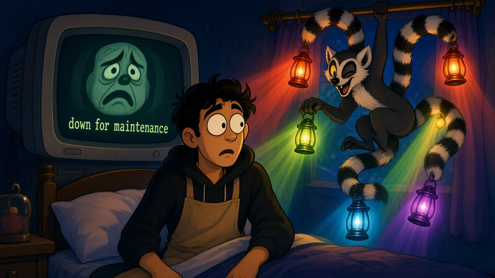 **3.1: leemerchat, "backup's here"** |
|  **3.2: critique, exit 2** | 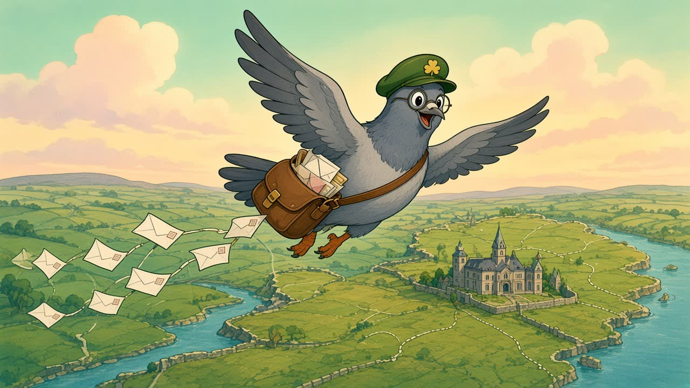 **3.3: dáildex, straight from the record** |
|  **ch 4: the middle** |  **ch 6: receipts** |
|  **ch 7: write one** |  **ch 8: not even close** |

Notes from the concepts, already fixed in the manifest prompts: Ray drifted to slightly pointed ears (prompts now say "normal rounded human ears"), the ticket text came out as gibberish (tickets are now blank in the art, with real text in the DOM), and Leinster House drew as a castle (now described as a classical Georgian building with columns).

---

*Plan v2, October 2026. Supersedes v1 "cut glass". The crystal survives as the story's magic object.*
